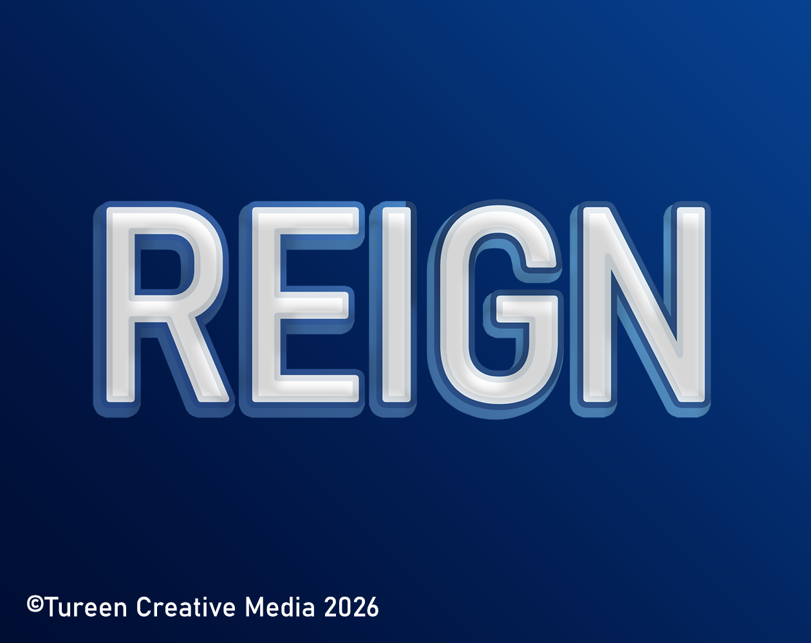
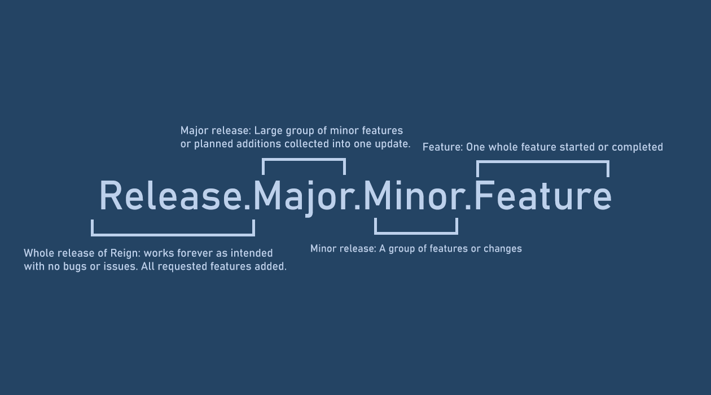

# Reign

---

### Changelog (v0.1.2.0)

    RELEASE TYPE: MINOR

- Updated default loading screen
- Added functionality to have softcoded additions to console commands
- Updated README for changelog, embedded thumbnail image and versioning information

---

### About

**Reign** is a lightweight framework/boilerplate for Unity created by ©Tureen Creative Media. Created to be used by people who want to develop a game (in Unity) without wasting time by setting up an ultra-performant backend.

---

### Features
- Expansive user interface widget system
- Save system (with decoding and encoding)
- Audio system
- Built-in developer console
- Discord RPC support
- Built-in loading screen
- Built-in playtime limiter (usually 3 hours)
- Time management (Scale manipulation)
- Application profiler
- Built-in user interface assets

---

### Updates and Contribution

    Milestones
    ✅ 0.1.0.0

**Versioning**
Reign's versioning system:

**Contribution**
Create pull requests to Reign's main GitHub branch: Tureen will manually read over additions or subtractions to the codebase.

---
    
### Installation

1. To use Reign, install the newest **release** from either [GitHub](https://github.com/TureenCreativeMedia/Reign/releases) or itch.io.

2. The release will contain a file with details about the release (Reign version, Unity version etc.)

3. Download the Unity version given and usually linked inside the file.

4. Drag the contents of the Reign release inside the Unity project.

---