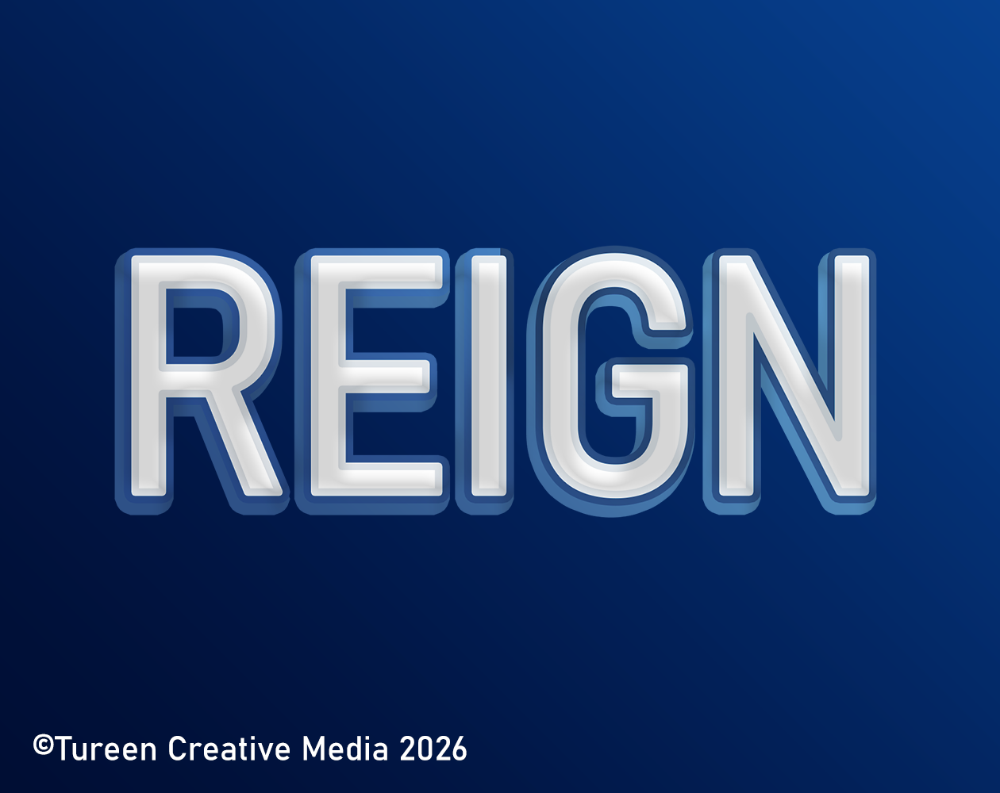
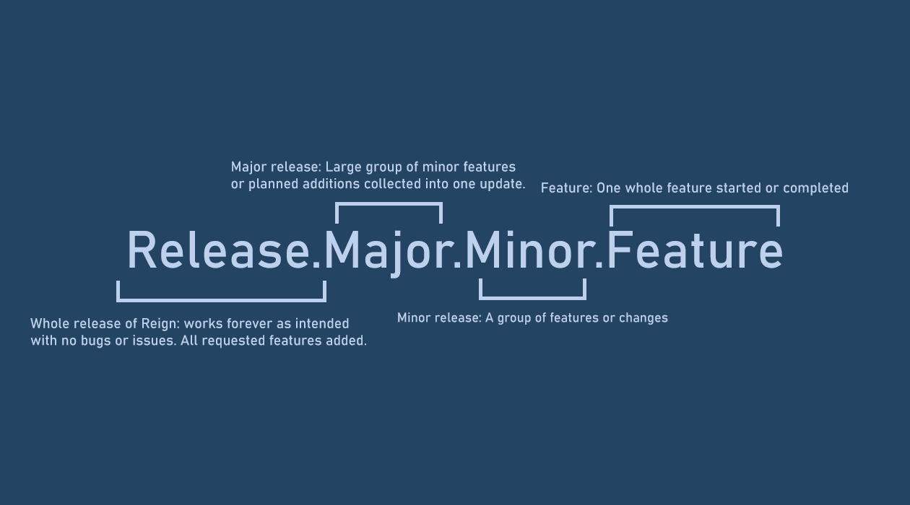

# Reign

[Reign Website](https://sites.google.com/view/reigntcm/home)  

---

### About

**Reign** is a lightweight framework for Unity created by Tureen. Created to be used by people who want to develop a game without creating a dynamic group of versatile systems to handle it.

---

### Features
- Systems
    - Input System -> Getting inputs via KeyCodes in a dictionary
    - Audio System -> Play sounds via AudioPool
    - Screen System -> Setting screen resolution and V-Sync depending on a struct in Save System 
    - App System -> Control Reign using the AppData scriptable object
    - Post Processing System -> Control post processing volume values with the Save System
    - Save System -> Control game saving and loading with scripts using the IDataHandler interface, as well as encrypting the saves.
    - Loading System -> Load scenes asynchronously with a transition.

---

### Updates 

    Milestones
    ✅ 0.1.0.0
    ✅ 0.3.0.0
    ✅ 0.5.0.0

---

### Versioning

**Reign's Version Release Map**

---

### Contribution

Create pull requests, Tureen will manually read over additions or subtractions to the Reign codebase.

---
    
### Installation
Follow the [instructions](https://github.com/TureenCreativeMedia/Reign/wiki#installation) on the wiki home page
